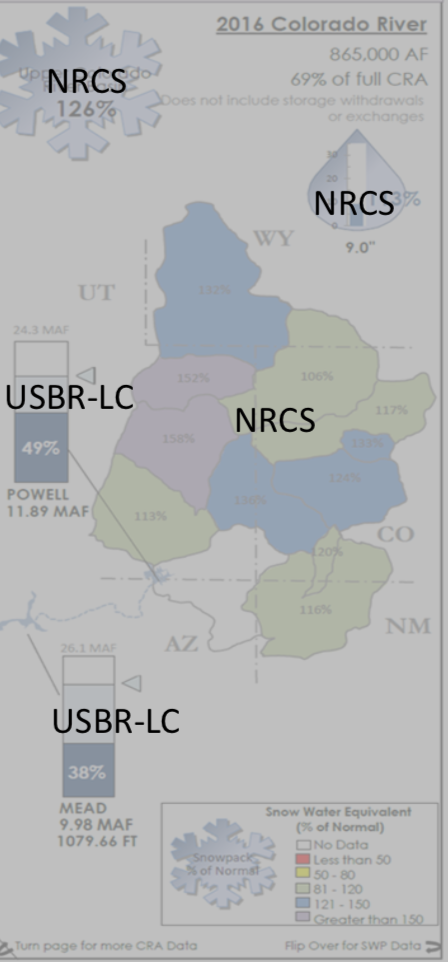

# colorado_river_supply
The goal of this project is to develop visualizations of Colorado river water supply and regional snowpack. Initially those will be exploratory in an ipython notebook. Time permitting, those will evolve into an interactive tool adding onto the existing [supply explorer](https://california-data-collaborative.github.io/cadc_reservoir_explorer/).

## Colorado River Basin water data sources

Here is an example water supply report courtesy of MWD: 

Below are the specific links for the data sources provided: 

* USBR-AG - https://www.usbr.gov/lc/region/g4000/hourly/forecast.pdf (pulling data from a pdf table -- probably able to be done via tabula or another data extractor since the pdf has that structure)
* NRCS - https://wcc.sc.egov.usda.gov/reports/SelectUpdateReport.html (this will require some artful web scraping to pull data from a web form)
* USBR-LC - https://www.usbr.gov/lc/region/g4000/hourly/levels.html (web scraping from an html table)
* USBR-Forecast - https://www.usbr.gov/lc/region/g4000/crss-5year.pdf (there's a table on page 7 -- need to double check how often this gets updated)
* USBR-Runoff - https://www.usbr.gov/lc/region/g4000/weekly.pdf (this will require designing a function to search through text from a PDF extract)
